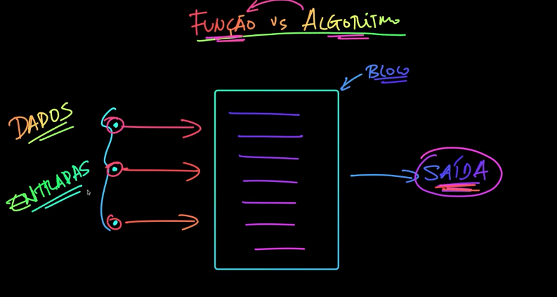

# 📙 Javascript
Temas fundamentais: Funções, objetos e arrays

## 👩🏻‍🏫 Algoritmo
Compreende a sequência de passos. As ordens dos passos importa, cuidado com erros e bugs. 


## 📌 O que é uma Função em JavaScript?
Uma função é um bloco de código que executa uma tarefa específica. Ela pode receber valores de entrada (parâmetros) e pode ou não retornar um resultado. As funções são fundamentais para organizar o código, tornando-o mais modular, reutilizável e legível.

🤖 Função vs Algoritmo: Qual a Diferença?
Função: É um bloco de código que executa uma ação específica.
Algoritmo: É uma sequência de passos que resolve um problema. Em outras palavras, um algoritmo pode ser implementado através de várias funções.
Resumindo:

🧩 O algoritmo é o plano (a sequência de passos).
⚙️ A função é a ferramenta que executa um desses passos.

🔑 Tipos de Declaração de Funções em JavaScript
1. Function Declaration
É uma maneira tradicional de declarar funções. Pode ser chamada antes da sua definição, devido ao conceito de "hoisting" em JavaScript.

```js
function saudacao() {
  console.log("Olá!");
}
```

2. Function Expression
Aqui, a função é atribuída a uma variável. Isso significa que a função só pode ser usada depois de declarada.

```js
const saudacao = function() {
  console.log("Olá!");
};
```

📋 Tipos de Funções: Entrada e Saída
Existem diferentes tipos de funções com base em como elas lidam com entradas (parâmetros) e saídas (retornos):

1. Sem Entrada e Sem Saída
Essas funções não recebem parâmetros nem retornam valores. Elas apenas executam uma ação.

```js
function exibirMensagem() {
  console.log("Executando ação!");
}
```

2. Com Entrada e Sem Saída
Essas funções recebem parâmetros (entrada) e executam uma ação, mas não retornam nada.

```js
function saudacao(nome) {
  console.log(`Olá, ${nome}!`);
}
```

3. Com Entrada e Com Saída
Recebem parâmetros e retornam um valor após o processamento.

```js
function soma(a, b) {
  return a + b;
}
```

4. Sem Entrada e Com Saída
Não recebem parâmetros, mas retornam algum valor.

```js
function obterHoraAtual() {
  return new Date().toLocaleTimeString();
}
```

## 📌   Arrays 
### For 
```js
const numeros = [32, 56, 43, 67, 89, 23, 54]; 

for(let i = 0; i < numeros.length; i++) {
  console.log(`${i} => ${numeros[i]}`); 
}
```

### For each 
```js
const numeros = [32, 56, 43, 67, 89, 23, 54]; 

// foreach => par acada elemento do array 

for (let numero of numeros ) { 
  console.log(numero); 
}
```

// para os índices 
```js
const numeros = [32, 56, 43, 67, 89, 23, 54]

for (let indice in indices) {
  console.log(indice);
}
```
### Funcionalidades Array 
```js
const numeros = [1, 2, 3, 4, 5, 6, 7, 10]; 
console.log(numeros.join(' - ')); 
//resposta: 1 - 2 - 3 - 4 - 5 - 6 - 7 - 10

console.log(numeros.includes(10))

// true
// includes: verifica se o valor está no array ou não

console.log(numeros.indexOf(2))
// vai verificar qual o índice da variavel localizada no array

//foreach
const nome = ['Ana', 'Bia', 'Carlos','Daniel', 'Rafael']; 

function paraCadaElemento(elemento, indice, array) {
  console.log(elemento, indice, array)
}

nome.forEach(paraCadaElemento); 
// resposta: Ana 0 [ 'Ana', 'Bia', 'Carlos', 'Daniel', 'Rafael' ]
```


## 📌 Objetos 
- Símbolo das chaves 
- Par: chave / valor   

Exemplo: 
```js
const produtos = { 
  nome: 'Caneta Bic Preta', 
  preco: 9.99, 
  desconto: 0.2, 
  altoCusto: false
}

console.log(`${produtos.nome}``); 
```

### Objeto com método 
```js
const produto = { 
  nome: 'Macbook', 
  preco: 3200, 
  desconto: 0.2, 
  precoComDesconto: function () { 
    return produto.preco - (produto.preco * produto.desconto);
  }
}

const produto = { 
  nome: 'Macbook', 
  preco: 3200, 
  desconto: 0.2, 
  precoComDesconto: function () { 
    return this.preco - (this.preco * this.desconto);
  }
}

console.log(produto.precoComDesconto()); 
```

- Objetos têm atributos e métodos

Exemplo 02: 
```js 
const cliente = { 
  codigo: 58934, 
  nome: 'Ana Medeiros Albuquerque', 
  vip: true, 
  endereco: { 
    logradouro: 'Rua XYZ', 
    numero: 987, 
    complemento: 'Apto 302, Bloco C', 
    pontosRef: 'Hospital São Pedro'
  }, 
  filhos: { 
    { nome: 'Grazielle Café', idade: 30 }, 
    { nome: 'Jéssica Ferreira;, idade: 28}, 
  }
}

console.log(cliente.filhos[1].nome); 
```

## Função Construtora 
```js 
// Função construtora -> Criar objetos 
// 1. Iniciar com letra maiúscula 
// 2. Criar utilizando a palavra new 
// 3. Usar o this para acrescentar atributos e métodos no objeto 

function data(dia, mes, ano) {
  console.log(dia, mes, ano)
}

const data1 = new Data(20, 10, 2024); 
console.log(data1); 
```

```js
class Data { 
  dia = 1 
  mes = 1
  ano = 1970
}

const data1 = new Data()
console.log(data1)
// Resultado: 
// Data { dia: 1, mes: 1, ano: 1970 } 
```

```js
// Construtor 
constructor(dia, mes, ano) { 
  this.dia = dia
  this.mes = mes 
  this.ano = ano
}

formatar () { 
  return `${this.dia}/${this.mes}/${this.ano}``
}